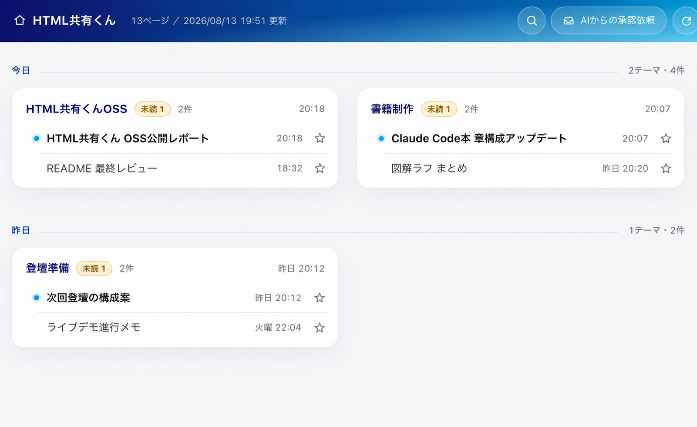
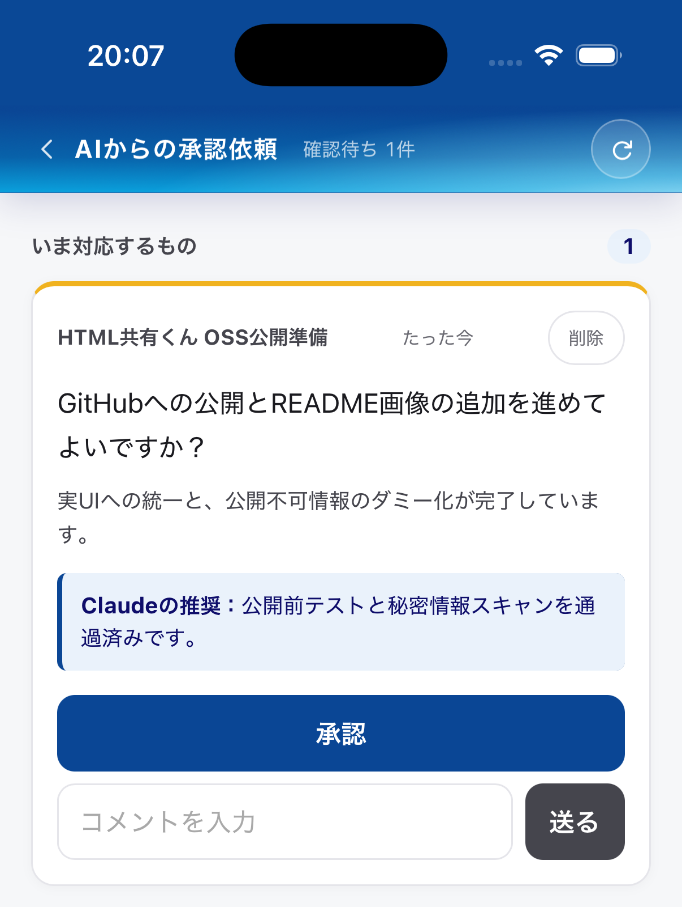

# HTML共有くん

HTML共有くんは、AIコーディングエージェントに作らせたHTMLを1か所へためて、スマホからも読めるようにするツールです。セットアップが済んだあとは、いつもどおりエージェントへ日本語で頼みます。

  
  &nbsp;
  

## 主な機能

- メモや調査結果を見やすいHTMLに整える
- 作ったHTMLを自分専用の一覧にためる
- 社内限定や期限付きのURLで共有する
- 読み終えたページを未読へ戻して、読み直す目印にする
- スマホとPCの間で依頼や承認をやり取りする

作者へページや回答を送らないセルフホスト型です。自分のAWSアカウントで動かせます。

## 対応エージェント

似た機能はAIツール側にもありますが、たいていそのツールの中で完結します。HTML共有くんの中身はCLIとスキルなので、Claude Code、Codex、Cursorなど手元のどのエージェントからでも同じように呼び出せます。

HTMLの見た目は同梱スキルのテンプレートで決めています。自分好みに書き換えれば、どのエージェントに頼んでも同じ様式で出てきます。作ったページも同じ一覧に集まるので、ツールを乗り換えても成果物は手元に残ります。

## スマホとの連携

PCを離れている間に思いついた作業は、スマホからインボックスへ置いておけます。戻ってきてからエージェントに `/inbox` と頼めば、置いた依頼を引き取って作業を始めます。

逆向きの `/mobile` は、PCで進行中の作業の確認依頼をスマホへ送ります。外出先で承認やコメントを返すと、PC側の作業へ引き継がれます。

## 頼み方の例

> このHTMLを共有くんに追加して

> この内容を見やすいHTMLにまとめて

> このページを社内限定で7日間共有して

> `/inbox` で、スマホから置いた依頼を引き取って

> `/mobile` で、今の作業をスマホから確認できるようにして

コマンドは覚えなくてOKです。登録も共有URLの発行も、エージェントがやります。

## セットアップ

導入方法は [初回セットアップ](docs/setup.md) にまとめています。公開前に確認したい仕組みは [セキュリティ設計](docs/threat-model.md) を参照してください。

## ライセンス

Apache License 2.0
